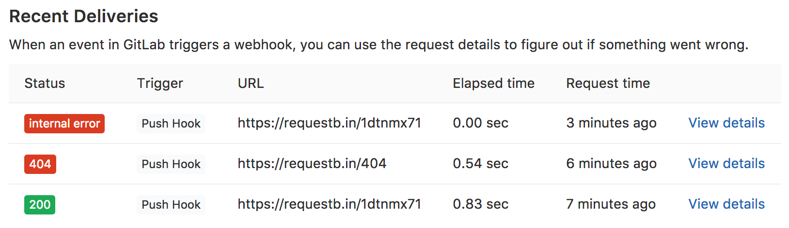

# Webhooks

>**Note:**
Starting from GitLab 8.5:
自GitLab 8.5起：
- the `repository` key is deprecated in favor of the `project` key--`repository`已弃用，改用`project`关键字
- the `project.ssh_url` key is deprecated in favor of the `project.git_ssh_url` key--`project.ssh_url`已弃用，改用`project.git_ssh_url`关键字
- the `project.http_url` key is deprecated in favor of the `project.git_http_url` key--`project.http_url`已弃用，改用`project.git_http_url`关键字

Project webhooks allow you to trigger a URL if for example new code is pushed or
a new issue is created. You can configure webhooks to listen for specific events
like pushes, issues or merge requests. GitLab will send a POST request with data
to the webhook URL.

项目webhooks允许你触发一个URL，例如，如果新的代码被推送或创建一个新的问题。 您可以配置webhook来监听特定的事件，如推送，问题或合并请求。 GitLab将发送带有数据的POST请求到webhook URL。

Webhooks can be used to update an external issue tracker, trigger CI jobs,
update a backup mirror, or even deploy to your production server.

Webhook可用于更新外部问题跟踪器，触发CI作业，更新备份镜像，甚至部署到生产服务器。

Navigate to the webhooks page by going to your project's
**Settings ➔ Integrations**.

webhooks页面位于：项目的**Settings ➔ Integrations**

## Webhook endpoint tips--Webhook的短点提示

If you are writing your own endpoint (web server) that will receive
GitLab webhooks keep in mind the following things:

如果你正在编写你自己的端点（web服务器）来接收GitLab的webhooks请记住以下几点：

-   Your endpoint should send its HTTP response as fast as possible. If
    you wait too long, GitLab may decide the hook failed and retry it.
    您的端点应尽可能快地发送HTTP响应。 如果您等待太久，GitLab可能会决定挂钩失败并重试。
    
-   Your endpoint should ALWAYS return a valid HTTP response. If you do
    not do this then GitLab will think the hook failed and retry it.
    Most HTTP libraries take care of this for you automatically but if
    you are writing a low-level hook this is important to remember.
    你的端点应该总是返回一个有效的HTTP响应。 如果你不这样做，那么GitLab会认为挂钩失败并重试。 大多数HTTP库会自动为您处理，但是如果您正在编写低级别的钩子，这一点很重要。
    
-   GitLab ignores the HTTP status code returned by your endpoint.--GitLab会忽略端点返回的HTTP状态码。


## Secret token--密钥

If you specify a secret token, it will be sent with the hook request in the
`X-Gitlab-Token` HTTP header. Your webhook endpoint can check that to verify
that the request is legitimate.

如果您指定了一个秘密令牌，它将与X-Gitlab-Token HTTP头中的挂接请求一起发送。 您的webhook端点可以检查以确认该请求是合法的。


## SSL verification--SSL验证

By default, the SSL certificate of the webhook endpoint is verified based on
an internal list of Certificate Authorities, which means the certificate cannot
be self-signed.

默认情况下，根据证书颁发机构的内部列表验证webhook端点的SSL证书，这意味着证书不能自签名。

You can turn this off in the webhook settings in your GitLab projects.

您可以在GitLab项目的webhook设置中关闭此功能。


## Events--事件

Below are described the supported events.

以下描述可支持的事件。

### Push events-推送事件

Triggered when you push to the repository except when pushing tags.

当你推送（除了推送基线）到存储库时可触发钩子。

**Request header--请求报文头**:

```
X-Gitlab-Event: Push Hook
```

**Request body--请求报文体:**

```json
{
  "object_kind": "push",
  "before": "95790bf891e76fee5e1747ab589903a6a1f80f22",
  "after": "da1560886d4f094c3e6c9ef40349f7d38b5d27d7",
  "ref": "refs/heads/master",
  "checkout_sha": "da1560886d4f094c3e6c9ef40349f7d38b5d27d7",
  "user_id": 4,
  "user_name": "John Smith",
  "user_username": "jsmith",
  "user_email": "john@example.com",
  "user_avatar": "https://s.gravatar.com/avatar/d4c74594d841139328695756648b6bd6?s=8://s.gravatar.com/avatar/d4c74594d841139328695756648b6bd6?s=80",
  "project_id": 15,
  "project":{
    "id": 15,
    "name":"Diaspora",
    "description":"",
    "web_url":"http://example.com/mike/diaspora",
    "avatar_url":null,
    "git_ssh_url":"git@example.com:mike/diaspora.git",
    "git_http_url":"http://example.com/mike/diaspora.git",
    "namespace":"Mike",
    "visibility_level":0,
    "path_with_namespace":"mike/diaspora",
    "default_branch":"master",
    "homepage":"http://example.com/mike/diaspora",
    "url":"git@example.com:mike/diaspora.git",
    "ssh_url":"git@example.com:mike/diaspora.git",
    "http_url":"http://example.com/mike/diaspora.git"
  },
  "repository":{
    "name": "Diaspora",
    "url": "git@example.com:mike/diaspora.git",
    "description": "",
    "homepage": "http://example.com/mike/diaspora",
    "git_http_url":"http://example.com/mike/diaspora.git",
    "git_ssh_url":"git@example.com:mike/diaspora.git",
    "visibility_level":0
  },
  "commits": [
    {
      "id": "b6568db1bc1dcd7f8b4d5a946b0b91f9dacd7327",
      "message": "Update Catalan translation to e38cb41.",
      "timestamp": "2011-12-12T14:27:31+02:00",
      "url": "http://example.com/mike/diaspora/commit/b6568db1bc1dcd7f8b4d5a946b0b91f9dacd7327",
      "author": {
        "name": "Jordi Mallach",
        "email": "jordi@softcatala.org"
      },
      "added": ["CHANGELOG"],
      "modified": ["app/controller/application.rb"],
      "removed": []
    },
    {
      "id": "da1560886d4f094c3e6c9ef40349f7d38b5d27d7",
      "message": "fixed readme",
      "timestamp": "2012-01-03T23:36:29+02:00",
      "url": "http://example.com/mike/diaspora/commit/da1560886d4f094c3e6c9ef40349f7d38b5d27d7",
      "author": {
        "name": "GitLab dev user",
        "email": "gitlabdev@dv6700.(none)"
      },
      "added": ["CHANGELOG"],
      "modified": ["app/controller/application.rb"],
      "removed": []
    }
  ],
  "total_commits_count": 4
}
```

### Tag events--基线事件

Triggered when you create (or delete) tags to the repository.

当创建或删除基线到存储库可触发钩子。

**Request header--请求报文头**:

```
X-Gitlab-Event: Tag Push Hook
```

**Request body:--请求报文体**

```json
{
  "object_kind": "tag_push",
  "before": "0000000000000000000000000000000000000000",
  "after": "82b3d5ae55f7080f1e6022629cdb57bfae7cccc7",
  "ref": "refs/tags/v1.0.0",
  "checkout_sha": "82b3d5ae55f7080f1e6022629cdb57bfae7cccc7",
  "user_id": 1,
  "user_name": "John Smith",
  "user_avatar": "https://s.gravatar.com/avatar/d4c74594d841139328695756648b6bd6?s=8://s.gravatar.com/avatar/d4c74594d841139328695756648b6bd6?s=80",
  "project_id": 1,
  "project":{
    "id": 1,
    "name":"Example",
    "description":"",
    "web_url":"http://example.com/jsmith/example",
    "avatar_url":null,
    "git_ssh_url":"git@example.com:jsmith/example.git",
    "git_http_url":"http://example.com/jsmith/example.git",
    "namespace":"Jsmith",
    "visibility_level":0,
    "path_with_namespace":"jsmith/example",
    "default_branch":"master",
    "homepage":"http://example.com/jsmith/example",
    "url":"git@example.com:jsmith/example.git",
    "ssh_url":"git@example.com:jsmith/example.git",
    "http_url":"http://example.com/jsmith/example.git"
  },
  "repository":{
    "name": "Example",
    "url": "ssh://git@example.com/jsmith/example.git",
    "description": "",
    "homepage": "http://example.com/jsmith/example",
    "git_http_url":"http://example.com/jsmith/example.git",
    "git_ssh_url":"git@example.com:jsmith/example.git",
    "visibility_level":0
  },
  "commits": [],
  "total_commits_count": 0
}
```

### Issues events--Issues事件

Triggered when a new issue is created or an existing issue was updated/closed/reopened.

当新的issue创建或现有的issue更新/关闭/重开。

**Request header--请求报文头**:

```
X-Gitlab-Event: Issue Hook
```

**Request body--请求报文体:**

```json
{
  "object_kind": "issue",
  "user": {
    "name": "Administrator",
    "username": "root",
    "avatar_url": "http://www.gravatar.com/avatar/e64c7d89f26bd1972efa854d13d7dd61?s=40\u0026d=identicon"
  },
  "project": {
    "id": 1,
    "name":"Gitlab Test",
    "description":"Aut reprehenderit ut est.",
    "web_url":"http://example.com/gitlabhq/gitlab-test",
    "avatar_url":null,
    "git_ssh_url":"git@example.com:gitlabhq/gitlab-test.git",
    "git_http_url":"http://example.com/gitlabhq/gitlab-test.git",
    "namespace":"GitlabHQ",
    "visibility_level":20,
    "path_with_namespace":"gitlabhq/gitlab-test",
    "default_branch":"master",
    "homepage":"http://example.com/gitlabhq/gitlab-test",
    "url":"http://example.com/gitlabhq/gitlab-test.git",
    "ssh_url":"git@example.com:gitlabhq/gitlab-test.git",
    "http_url":"http://example.com/gitlabhq/gitlab-test.git"
  },
  "repository": {
    "name": "Gitlab Test",
    "url": "http://example.com/gitlabhq/gitlab-test.git",
    "description": "Aut reprehenderit ut est.",
    "homepage": "http://example.com/gitlabhq/gitlab-test"
  },
  "object_attributes": {
    "id": 301,
    "title": "New API: create/update/delete file",
    "assignee_ids": [51],
    "assignee_id": 51,
    "author_id": 51,
    "project_id": 14,
    "created_at": "2013-12-03T17:15:43Z",
    "updated_at": "2013-12-03T17:15:43Z",
    "position": 0,
    "branch_name": null,
    "description": "Create new API for manipulations with repository",
    "milestone_id": null,
    "state": "opened",
    "iid": 23,
    "url": "http://example.com/diaspora/issues/23",
    "action": "open"
  },
  "assignees": [{
    "name": "User1",
    "username": "user1",
    "avatar_url": "http://www.gravatar.com/avatar/e64c7d89f26bd1972efa854d13d7dd61?s=40\u0026d=identicon"
  }],
  "assignee": {
    "name": "User1",
    "username": "user1",
    "avatar_url": "http://www.gravatar.com/avatar/e64c7d89f26bd1972efa854d13d7dd61?s=40\u0026d=identicon"
  },
  "labels": [{
    "id": 206,
    "title": "API",
    "color": "#ffffff",
    "project_id": 14,
    "created_at": "2013-12-03T17:15:43Z",
    "updated_at": "2013-12-03T17:15:43Z",
    "template": false,
    "description": "API related issues",
    "type": "ProjectLabel",
    "group_id": 41
  }],
  "changes": {
    "updated_by_id": [null, 1],
    "updated_at": ["2017-09-15 16:50:55 UTC", "2017-09-15 16:52:00 UTC"],
    "labels": {
      "previous": [{
        "id": 206,
        "title": "API",
        "color": "#ffffff",
        "project_id": 14,
        "created_at": "2013-12-03T17:15:43Z",
        "updated_at": "2013-12-03T17:15:43Z",
        "template": false,
        "description": "API related issues",
        "type": "ProjectLabel",
        "group_id": 41
      }],
      "current": [{
        "id": 205,
        "title": "Platform",
        "color": "#123123",
        "project_id": 14,
        "created_at": "2013-12-03T17:15:43Z",
        "updated_at": "2013-12-03T17:15:43Z",
        "template": false,
        "description": "Platform related issues",
        "type": "ProjectLabel",
        "group_id": 41
      }]
    }
  }
}
```

**Note**: `assignee` and `assignee_id` keys are deprecated and now show the first assignee only.
`assignee` 和 `assignee_id`关键字以弃用，目前仅显示首个assignee。

### Comment events--评论事件

Triggered when a new comment is made on commits, merge requests, issues, and code snippets.
The note data will be stored in `object_attributes` (e.g. `note`, `noteable_type`). The
payload will also include information about the target of the comment. For example,
a comment on a issue will include the specific issue information under the `issue` key.
Valid target types:

当提交、合并请求、issues、代码片段有新的评论时可触发钩子。笔记数据将保存在`object_attributes` (例如： `note`, `noteable_type`)。有效载荷（payload）还将包括有关评论目标的信息。 例如，对问题的评论将包括问题关键字下的具体问题信息。 有效的目标类型：

1. `commit`
2. `merge_request`
3. `issue`
4. `snippet`

#### Comment on commit

**Request header**:

```
X-Gitlab-Event: Note Hook
```

**Request body:**

```json
{
  "object_kind": "note",
  "user": {
    "name": "Administrator",
    "username": "root",
    "avatar_url": "http://www.gravatar.com/avatar/e64c7d89f26bd1972efa854d13d7dd61?s=40\u0026d=identicon"
  },
  "project_id": 5,
  "project":{
    "id": 5,
    "name":"Gitlab Test",
    "description":"Aut reprehenderit ut est.",
    "web_url":"http://example.com/gitlabhq/gitlab-test",
    "avatar_url":null,
    "git_ssh_url":"git@example.com:gitlabhq/gitlab-test.git",
    "git_http_url":"http://example.com/gitlabhq/gitlab-test.git",
    "namespace":"GitlabHQ",
    "visibility_level":20,
    "path_with_namespace":"gitlabhq/gitlab-test",
    "default_branch":"master",
    "homepage":"http://example.com/gitlabhq/gitlab-test",
    "url":"http://example.com/gitlabhq/gitlab-test.git",
    "ssh_url":"git@example.com:gitlabhq/gitlab-test.git",
    "http_url":"http://example.com/gitlabhq/gitlab-test.git"
  },
  "repository":{
    "name": "Gitlab Test",
    "url": "http://example.com/gitlab-org/gitlab-test.git",
    "description": "Aut reprehenderit ut est.",
    "homepage": "http://example.com/gitlab-org/gitlab-test"
  },
  "object_attributes": {
    "id": 1243,
    "note": "This is a commit comment. How does this work?",
    "noteable_type": "Commit",
    "author_id": 1,
    "created_at": "2015-05-17 18:08:09 UTC",
    "updated_at": "2015-05-17 18:08:09 UTC",
    "project_id": 5,
    "attachment":null,
    "line_code": "bec9703f7a456cd2b4ab5fb3220ae016e3e394e3_0_1",
    "commit_id": "cfe32cf61b73a0d5e9f13e774abde7ff789b1660",
    "noteable_id": null,
    "system": false,
    "st_diff": {
      "diff": "--- /dev/null\n+++ b/six\n@@ -0,0 +1 @@\n+Subproject commit 409f37c4f05865e4fb208c771485f211a22c4c2d\n",
      "new_path": "six",
      "old_path": "six",
      "a_mode": "0",
      "b_mode": "160000",
      "new_file": true,
      "renamed_file": false,
      "deleted_file": false
    },
    "url": "http://example.com/gitlab-org/gitlab-test/commit/cfe32cf61b73a0d5e9f13e774abde7ff789b1660#note_1243"
  },
  "commit": {
    "id": "cfe32cf61b73a0d5e9f13e774abde7ff789b1660",
    "message": "Add submodule\n\nSigned-off-by: Dmitriy Zaporozhets \u003cdmitriy.zaporozhets@gmail.com\u003e\n",
    "timestamp": "2014-02-27T10:06:20+02:00",
    "url": "http://example.com/gitlab-org/gitlab-test/commit/cfe32cf61b73a0d5e9f13e774abde7ff789b1660",
    "author": {
      "name": "Dmitriy Zaporozhets",
      "email": "dmitriy.zaporozhets@gmail.com"
    }
  }
}
```

#### Comment on merge request

**Request header**:

```
X-Gitlab-Event: Note Hook
```

**Request body:**

```json
{
  "object_kind": "note",
  "user": {
    "name": "Administrator",
    "username": "root",
    "avatar_url": "http://www.gravatar.com/avatar/e64c7d89f26bd1972efa854d13d7dd61?s=40\u0026d=identicon"
  },
  "project_id": 5,
  "project":{
    "id": 5,
    "name":"Gitlab Test",
    "description":"Aut reprehenderit ut est.",
    "web_url":"http://example.com/gitlab-org/gitlab-test",
    "avatar_url":null,
    "git_ssh_url":"git@example.com:gitlab-org/gitlab-test.git",
    "git_http_url":"http://example.com/gitlab-org/gitlab-test.git",
    "namespace":"Gitlab Org",
    "visibility_level":10,
    "path_with_namespace":"gitlab-org/gitlab-test",
    "default_branch":"master",
    "homepage":"http://example.com/gitlab-org/gitlab-test",
    "url":"http://example.com/gitlab-org/gitlab-test.git",
    "ssh_url":"git@example.com:gitlab-org/gitlab-test.git",
    "http_url":"http://example.com/gitlab-org/gitlab-test.git"
  },
  "repository":{
    "name": "Gitlab Test",
    "url": "http://localhost/gitlab-org/gitlab-test.git",
    "description": "Aut reprehenderit ut est.",
    "homepage": "http://example.com/gitlab-org/gitlab-test"
  },
  "object_attributes": {
    "id": 1244,
    "note": "This MR needs work.",
    "noteable_type": "MergeRequest",
    "author_id": 1,
    "created_at": "2015-05-17 18:21:36 UTC",
    "updated_at": "2015-05-17 18:21:36 UTC",
    "project_id": 5,
    "attachment": null,
    "line_code": null,
    "commit_id": "",
    "noteable_id": 7,
    "system": false,
    "st_diff": null,
    "url": "http://example.com/gitlab-org/gitlab-test/merge_requests/1#note_1244"
  },
  "merge_request": {
    "id": 7,
    "target_branch": "markdown",
    "source_branch": "master",
    "source_project_id": 5,
    "author_id": 8,
    "assignee_id": 28,
    "title": "Tempora et eos debitis quae laborum et.",
    "created_at": "2015-03-01 20:12:53 UTC",
    "updated_at": "2015-03-21 18:27:27 UTC",
    "milestone_id": 11,
    "state": "opened",
    "merge_status": "cannot_be_merged",
    "target_project_id": 5,
    "iid": 1,
    "description": "Et voluptas corrupti assumenda temporibus. Architecto cum animi eveniet amet asperiores. Vitae numquam voluptate est natus sit et ad id.",
    "position": 0,
    "source":{
      "name":"Gitlab Test",
      "description":"Aut reprehenderit ut est.",
      "web_url":"http://example.com/gitlab-org/gitlab-test",
      "avatar_url":null,
      "git_ssh_url":"git@example.com:gitlab-org/gitlab-test.git",
      "git_http_url":"http://example.com/gitlab-org/gitlab-test.git",
      "namespace":"Gitlab Org",
      "visibility_level":10,
      "path_with_namespace":"gitlab-org/gitlab-test",
      "default_branch":"master",
      "homepage":"http://example.com/gitlab-org/gitlab-test",
      "url":"http://example.com/gitlab-org/gitlab-test.git",
      "ssh_url":"git@example.com:gitlab-org/gitlab-test.git",
      "http_url":"http://example.com/gitlab-org/gitlab-test.git"
    },
    "target": {
      "name":"Gitlab Test",
      "description":"Aut reprehenderit ut est.",
      "web_url":"http://example.com/gitlab-org/gitlab-test",
      "avatar_url":null,
      "git_ssh_url":"git@example.com:gitlab-org/gitlab-test.git",
      "git_http_url":"http://example.com/gitlab-org/gitlab-test.git",
      "namespace":"Gitlab Org",
      "visibility_level":10,
      "path_with_namespace":"gitlab-org/gitlab-test",
      "default_branch":"master",
      "homepage":"http://example.com/gitlab-org/gitlab-test",
      "url":"http://example.com/gitlab-org/gitlab-test.git",
      "ssh_url":"git@example.com:gitlab-org/gitlab-test.git",
      "http_url":"http://example.com/gitlab-org/gitlab-test.git"
    },
    "last_commit": {
      "id": "562e173be03b8ff2efb05345d12df18815438a4b",
      "message": "Merge branch 'another-branch' into 'master'\n\nCheck in this test\n",
      "timestamp": "2015-04-08T21: 00:25-07:00",
      "url": "http://example.com/gitlab-org/gitlab-test/commit/562e173be03b8ff2efb05345d12df18815438a4b",
      "author": {
        "name": "John Smith",
        "email": "john@example.com"
      }
    },
    "work_in_progress": false,
    "assignee": {
      "name": "User1",
      "username": "user1",
      "avatar_url": "http://www.gravatar.com/avatar/e64c7d89f26bd1972efa854d13d7dd61?s=40\u0026d=identicon"
    }
  }
}
```

#### Comment on issue

**Request header**:

```
X-Gitlab-Event: Note Hook
```

**Request body:**

```json
{
  "object_kind": "note",
  "user": {
    "name": "Administrator",
    "username": "root",
    "avatar_url": "http://www.gravatar.com/avatar/e64c7d89f26bd1972efa854d13d7dd61?s=40\u0026d=identicon"
  },
  "project_id": 5,
  "project":{
    "id": 5,
    "name":"Gitlab Test",
    "description":"Aut reprehenderit ut est.",
    "web_url":"http://example.com/gitlab-org/gitlab-test",
    "avatar_url":null,
    "git_ssh_url":"git@example.com:gitlab-org/gitlab-test.git",
    "git_http_url":"http://example.com/gitlab-org/gitlab-test.git",
    "namespace":"Gitlab Org",
    "visibility_level":10,
    "path_with_namespace":"gitlab-org/gitlab-test",
    "default_branch":"master",
    "homepage":"http://example.com/gitlab-org/gitlab-test",
    "url":"http://example.com/gitlab-org/gitlab-test.git",
    "ssh_url":"git@example.com:gitlab-org/gitlab-test.git",
    "http_url":"http://example.com/gitlab-org/gitlab-test.git"
  },
  "repository":{
    "name":"diaspora",
    "url":"git@example.com:mike/diaspora.git",
    "description":"",
    "homepage":"http://example.com/mike/diaspora"
  },
  "object_attributes": {
    "id": 1241,
    "note": "Hello world",
    "noteable_type": "Issue",
    "author_id": 1,
    "created_at": "2015-05-17 17:06:40 UTC",
    "updated_at": "2015-05-17 17:06:40 UTC",
    "project_id": 5,
    "attachment": null,
    "line_code": null,
    "commit_id": "",
    "noteable_id": 92,
    "system": false,
    "st_diff": null,
    "url": "http://example.com/gitlab-org/gitlab-test/issues/17#note_1241"
  },
  "issue": {
    "id": 92,
    "title": "test",
    "assignee_ids": [],
    "assignee_id": null,
    "author_id": 1,
    "project_id": 5,
    "created_at": "2015-04-12 14:53:17 UTC",
    "updated_at": "2015-04-26 08:28:42 UTC",
    "position": 0,
    "branch_name": null,
    "description": "test",
    "milestone_id": null,
    "state": "closed",
    "iid": 17
  }
}
```

**Note**: `assignee_id` field is deprecated and now shows the first assignee only.

#### Comment on code snippet

**Request header**:

```
X-Gitlab-Event: Note Hook
```

**Request body:**

```json
{
  "object_kind": "note",
  "user": {
    "name": "Administrator",
    "username": "root",
    "avatar_url": "http://www.gravatar.com/avatar/e64c7d89f26bd1972efa854d13d7dd61?s=40\u0026d=identicon"
  },
  "project_id": 5,
  "project":{
    "id": 5,
    "name":"Gitlab Test",
    "description":"Aut reprehenderit ut est.",
    "web_url":"http://example.com/gitlab-org/gitlab-test",
    "avatar_url":null,
    "git_ssh_url":"git@example.com:gitlab-org/gitlab-test.git",
    "git_http_url":"http://example.com/gitlab-org/gitlab-test.git",
    "namespace":"Gitlab Org",
    "visibility_level":10,
    "path_with_namespace":"gitlab-org/gitlab-test",
    "default_branch":"master",
    "homepage":"http://example.com/gitlab-org/gitlab-test",
    "url":"http://example.com/gitlab-org/gitlab-test.git",
    "ssh_url":"git@example.com:gitlab-org/gitlab-test.git",
    "http_url":"http://example.com/gitlab-org/gitlab-test.git"
  },
  "repository":{
    "name":"Gitlab Test",
    "url":"http://example.com/gitlab-org/gitlab-test.git",
    "description":"Aut reprehenderit ut est.",
    "homepage":"http://example.com/gitlab-org/gitlab-test"
  },
  "object_attributes": {
    "id": 1245,
    "note": "Is this snippet doing what it's supposed to be doing?",
    "noteable_type": "Snippet",
    "author_id": 1,
    "created_at": "2015-05-17 18:35:50 UTC",
    "updated_at": "2015-05-17 18:35:50 UTC",
    "project_id": 5,
    "attachment": null,
    "line_code": null,
    "commit_id": "",
    "noteable_id": 53,
    "system": false,
    "st_diff": null,
    "url": "http://example.com/gitlab-org/gitlab-test/snippets/53#note_1245"
  },
  "snippet": {
    "id": 53,
    "title": "test",
    "content": "puts 'Hello world'",
    "author_id": 1,
    "project_id": 5,
    "created_at": "2015-04-09 02:40:38 UTC",
    "updated_at": "2015-04-09 02:40:38 UTC",
    "file_name": "test.rb",
    "expires_at": null,
    "type": "ProjectSnippet",
    "visibility_level": 0
  }
}
```

### Merge request events

Triggered when a new merge request is created, an existing merge request was updated/merged/closed or a commit is added in the source branch.

**Request header**:

```
X-Gitlab-Event: Merge Request Hook
```

**Request body:**

```json
{
  "object_kind": "merge_request",
  "user": {
    "name": "Administrator",
    "username": "root",
    "avatar_url": "http://www.gravatar.com/avatar/e64c7d89f26bd1972efa854d13d7dd61?s=40\u0026d=identicon"
  },
  "project": {
    "id": 1,
    "name":"Gitlab Test",
    "description":"Aut reprehenderit ut est.",
    "web_url":"http://example.com/gitlabhq/gitlab-test",
    "avatar_url":null,
    "git_ssh_url":"git@example.com:gitlabhq/gitlab-test.git",
    "git_http_url":"http://example.com/gitlabhq/gitlab-test.git",
    "namespace":"GitlabHQ",
    "visibility_level":20,
    "path_with_namespace":"gitlabhq/gitlab-test",
    "default_branch":"master",
    "homepage":"http://example.com/gitlabhq/gitlab-test",
    "url":"http://example.com/gitlabhq/gitlab-test.git",
    "ssh_url":"git@example.com:gitlabhq/gitlab-test.git",
    "http_url":"http://example.com/gitlabhq/gitlab-test.git"
  },
  "repository": {
    "name": "Gitlab Test",
    "url": "http://example.com/gitlabhq/gitlab-test.git",
    "description": "Aut reprehenderit ut est.",
    "homepage": "http://example.com/gitlabhq/gitlab-test"
  },
  "object_attributes": {
    "id": 99,
    "target_branch": "master",
    "source_branch": "ms-viewport",
    "source_project_id": 14,
    "author_id": 51,
    "assignee_id": 6,
    "title": "MS-Viewport",
    "created_at": "2013-12-03T17:23:34Z",
    "updated_at": "2013-12-03T17:23:34Z",
    "st_commits": null,
    "st_diffs": null,
    "milestone_id": null,
    "state": "opened",
    "merge_status": "unchecked",
    "target_project_id": 14,
    "iid": 1,
    "description": "",
    "source": {
      "name":"Awesome Project",
      "description":"Aut reprehenderit ut est.",
      "web_url":"http://example.com/awesome_space/awesome_project",
      "avatar_url":null,
      "git_ssh_url":"git@example.com:awesome_space/awesome_project.git",
      "git_http_url":"http://example.com/awesome_space/awesome_project.git",
      "namespace":"Awesome Space",
      "visibility_level":20,
      "path_with_namespace":"awesome_space/awesome_project",
      "default_branch":"master",
      "homepage":"http://example.com/awesome_space/awesome_project",
      "url":"http://example.com/awesome_space/awesome_project.git",
      "ssh_url":"git@example.com:awesome_space/awesome_project.git",
      "http_url":"http://example.com/awesome_space/awesome_project.git"
    },
    "target": {
      "name":"Awesome Project",
      "description":"Aut reprehenderit ut est.",
      "web_url":"http://example.com/awesome_space/awesome_project",
      "avatar_url":null,
      "git_ssh_url":"git@example.com:awesome_space/awesome_project.git",
      "git_http_url":"http://example.com/awesome_space/awesome_project.git",
      "namespace":"Awesome Space",
      "visibility_level":20,
      "path_with_namespace":"awesome_space/awesome_project",
      "default_branch":"master",
      "homepage":"http://example.com/awesome_space/awesome_project",
      "url":"http://example.com/awesome_space/awesome_project.git",
      "ssh_url":"git@example.com:awesome_space/awesome_project.git",
      "http_url":"http://example.com/awesome_space/awesome_project.git"
    },
    "last_commit": {
      "id": "da1560886d4f094c3e6c9ef40349f7d38b5d27d7",
      "message": "fixed readme",
      "timestamp": "2012-01-03T23:36:29+02:00",
      "url": "http://example.com/awesome_space/awesome_project/commits/da1560886d4f094c3e6c9ef40349f7d38b5d27d7",
      "author": {
        "name": "GitLab dev user",
        "email": "gitlabdev@dv6700.(none)"
      }
    },
    "work_in_progress": false,
    "url": "http://example.com/diaspora/merge_requests/1",
    "action": "open",
    "assignee": {
      "name": "User1",
      "username": "user1",
      "avatar_url": "http://www.gravatar.com/avatar/e64c7d89f26bd1972efa854d13d7dd61?s=40\u0026d=identicon"
    }
  },
  "labels": [{
    "id": 206,
    "title": "API",
    "color": "#ffffff",
    "project_id": 14,
    "created_at": "2013-12-03T17:15:43Z",
    "updated_at": "2013-12-03T17:15:43Z",
    "template": false,
    "description": "API related issues",
    "type": "ProjectLabel",
    "group_id": 41
  }],
  "changes": {
    "updated_by_id": [null, 1],
    "updated_at": ["2017-09-15 16:50:55 UTC", "2017-09-15 16:52:00 UTC"],
    "labels": {
      "previous": [{
        "id": 206,
        "title": "API",
        "color": "#ffffff",
        "project_id": 14,
        "created_at": "2013-12-03T17:15:43Z",
        "updated_at": "2013-12-03T17:15:43Z",
        "template": false,
        "description": "API related issues",
        "type": "ProjectLabel",
        "group_id": 41
      }],
      "current": [{
        "id": 205,
        "title": "Platform",
        "color": "#123123",
        "project_id": 14,
        "created_at": "2013-12-03T17:15:43Z",
        "updated_at": "2013-12-03T17:15:43Z",
        "template": false,
        "description": "Platform related issues",
        "type": "ProjectLabel",
        "group_id": 41
      }]
    }
  }
}
```

### Wiki Page events

Triggered when a wiki page is created, updated or deleted.

**Request Header**:

```
X-Gitlab-Event: Wiki Page Hook
```

**Request Body**:

```json
{
  "object_kind": "wiki_page",
  "user": {
    "name": "Administrator",
    "username": "root",
    "avatar_url": "http://www.gravatar.com/avatar/e64c7d89f26bd1972efa854d13d7dd61?s=80\u0026d=identicon"
  },
  "project": {
    "id": 1,
    "name": "awesome-project",
    "description": "This is awesome",
    "web_url": "http://example.com/root/awesome-project",
    "avatar_url": null,
    "git_ssh_url": "git@example.com:root/awesome-project.git",
    "git_http_url": "http://example.com/root/awesome-project.git",
    "namespace": "root",
    "visibility_level": 0,
    "path_with_namespace": "root/awesome-project",
    "default_branch": "master",
    "homepage": "http://example.com/root/awesome-project",
    "url": "git@example.com:root/awesome-project.git",
    "ssh_url": "git@example.com:root/awesome-project.git",
    "http_url": "http://example.com/root/awesome-project.git"
  },
  "wiki": {
    "web_url": "http://example.com/root/awesome-project/wikis/home",
    "git_ssh_url": "git@example.com:root/awesome-project.wiki.git",
    "git_http_url": "http://example.com/root/awesome-project.wiki.git",
    "path_with_namespace": "root/awesome-project.wiki",
    "default_branch": "master"
  },
  "object_attributes": {
    "title": "Awesome",
    "content": "awesome content goes here",
    "format": "markdown",
    "message": "adding an awesome page to the wiki",
    "slug": "awesome",
    "url": "http://example.com/root/awesome-project/wikis/awesome",
    "action": "create"
  }
}
```

### Pipeline events

Triggered on status change of Pipeline.

当Pipeline状态改变时可触发钩子。

**Request Header**:

```
X-Gitlab-Event: Pipeline Hook
```

**Request Body**:

```json
{
   "object_kind": "pipeline",
   "object_attributes":{
      "id": 31,
      "ref": "master",
      "tag": false,
      "sha": "bcbb5ec396a2c0f828686f14fac9b80b780504f2",
      "before_sha": "bcbb5ec396a2c0f828686f14fac9b80b780504f2",
      "status": "success",
      "stages":[
         "build",
         "test",
         "deploy"
      ],
      "created_at": "2016-08-12 15:23:28 UTC",
      "finished_at": "2016-08-12 15:26:29 UTC",
      "duration": 63
   },
   "user":{
      "name": "Administrator",
      "username": "root",
      "avatar_url": "http://www.gravatar.com/avatar/e32bd13e2add097461cb96824b7a829c?s=80\u0026d=identicon"
   },
   "project":{
      "id": 1,
      "name": "Gitlab Test",
      "description": "Atque in sunt eos similique dolores voluptatem.",
      "web_url": "http://192.168.64.1:3005/gitlab-org/gitlab-test",
      "avatar_url": null,
      "git_ssh_url": "git@192.168.64.1:gitlab-org/gitlab-test.git",
      "git_http_url": "http://192.168.64.1:3005/gitlab-org/gitlab-test.git",
      "namespace": "Gitlab Org",
      "visibility_level": 20,
      "path_with_namespace": "gitlab-org/gitlab-test",
      "default_branch": "master"
   },
   "commit":{
      "id": "bcbb5ec396a2c0f828686f14fac9b80b780504f2",
      "message": "test\n",
      "timestamp": "2016-08-12T17:23:21+02:00",
      "url": "http://example.com/gitlab-org/gitlab-test/commit/bcbb5ec396a2c0f828686f14fac9b80b780504f2",
      "author":{
         "name": "User",
         "email": "user@gitlab.com"
      }
   },
   "builds":[
      {
         "id": 380,
         "stage": "deploy",
         "name": "production",
         "status": "skipped",
         "created_at": "2016-08-12 15:23:28 UTC",
         "started_at": null,
         "finished_at": null,
         "when": "manual",
         "manual": true,
         "user":{
            "name": "Administrator",
            "username": "root",
            "avatar_url": "http://www.gravatar.com/avatar/e32bd13e2add097461cb96824b7a829c?s=80\u0026d=identicon"
         },
         "runner": null,
         "artifacts_file":{
            "filename": null,
            "size": null
         }
      },
      {
         "id": 377,
         "stage": "test",
         "name": "test-image",
         "status": "success",
         "created_at": "2016-08-12 15:23:28 UTC",
         "started_at": "2016-08-12 15:26:12 UTC",
         "finished_at": null,
         "when": "on_success",
         "manual": false,
         "user":{
            "name": "Administrator",
            "username": "root",
            "avatar_url": "http://www.gravatar.com/avatar/e32bd13e2add097461cb96824b7a829c?s=80\u0026d=identicon"
         },
         "runner": null,
         "artifacts_file":{
            "filename": null,
            "size": null
         }
      },
      {
         "id": 378,
         "stage": "test",
         "name": "test-build",
         "status": "success",
         "created_at": "2016-08-12 15:23:28 UTC",
         "started_at": "2016-08-12 15:26:12 UTC",
         "finished_at": "2016-08-12 15:26:29 UTC",
         "when": "on_success",
         "manual": false,
         "user":{
            "name": "Administrator",
            "username": "root",
            "avatar_url": "http://www.gravatar.com/avatar/e32bd13e2add097461cb96824b7a829c?s=80\u0026d=identicon"
         },
         "runner": null,
         "artifacts_file":{
            "filename": null,
            "size": null
         }
      },
      {
         "id": 376,
         "stage": "build",
         "name": "build-image",
         "status": "success",
         "created_at": "2016-08-12 15:23:28 UTC",
         "started_at": "2016-08-12 15:24:56 UTC",
         "finished_at": "2016-08-12 15:25:26 UTC",
         "when": "on_success",
         "manual": false,
         "user":{
            "name": "Administrator",
            "username": "root",
            "avatar_url": "http://www.gravatar.com/avatar/e32bd13e2add097461cb96824b7a829c?s=80\u0026d=identicon"
         },
         "runner": null,
         "artifacts_file":{
            "filename": null,
            "size": null
         }
      },
      {
         "id": 379,
         "stage": "deploy",
         "name": "staging",
         "status": "created",
         "created_at": "2016-08-12 15:23:28 UTC",
         "started_at": null,
         "finished_at": null,
         "when": "on_success",
         "manual": false,
         "user":{
            "name": "Administrator",
            "username": "root",
            "avatar_url": "http://www.gravatar.com/avatar/e32bd13e2add097461cb96824b7a829c?s=80\u0026d=identicon"
         },
         "runner": null,
         "artifacts_file":{
            "filename": null,
            "size": null
         }
      }
   ]
}
```

### Build events--构建事件

Triggered on status change of a Build.

构建状态的改变可触发钩子。

**Request Header**:

```
X-Gitlab-Event: Build Hook
```

**Request Body**:

```json
{
  "object_kind": "build",
  "ref": "gitlab-script-trigger",
  "tag": false,
  "before_sha": "2293ada6b400935a1378653304eaf6221e0fdb8f",
  "sha": "2293ada6b400935a1378653304eaf6221e0fdb8f",
  "build_id": 1977,
  "build_name": "test",
  "build_stage": "test",
  "build_status": "created",
  "build_started_at": null,
  "build_finished_at": null,
  "build_duration": null,
  "build_allow_failure": false,
  "project_id": 380,
  "project_name": "gitlab-org/gitlab-test",
  "user": {
    "id": 3,
    "name": "User",
    "email": "user@gitlab.com"
  },
  "commit": {
    "id": 2366,
    "sha": "2293ada6b400935a1378653304eaf6221e0fdb8f",
    "message": "test\n",
    "author_name": "User",
    "author_email": "user@gitlab.com",
    "status": "created",
    "duration": null,
    "started_at": null,
    "finished_at": null
  },
  "repository": {
    "name": "gitlab_test",
    "git_ssh_url": "git@192.168.64.1:gitlab-org/gitlab-test.git",
    "description": "Atque in sunt eos similique dolores voluptatem.",
    "homepage": "http://192.168.64.1:3005/gitlab-org/gitlab-test",
    "git_ssh_url": "git@192.168.64.1:gitlab-org/gitlab-test.git",
    "git_http_url": "http://192.168.64.1:3005/gitlab-org/gitlab-test.git",
    "visibility_level": 20
  }
}
```

## Testing webhooks--测试钩子

You can trigger the webhook manually. Sample data from the project will be used.Sample data will take from the project.
> For example: for triggering `Push Events` your project should have at least one commit.

你可以手动触发钩子，将使用项目的样例数据。样例数据将从项目中去。
例如：为了触发`Push Events`，你要在项目中只是提交一次。


## Troubleshoot webhooks--钩子的疑难解答

Gitlab stores each perform of the webhook.

GigLab保存每个钩子的执行结果。

You can find records for last 2 days in "Recent Deliveries" section on the edit page of each webhook.

你可以在每个钩子的编辑页面的"Recent Deliveries"部分产看最新2天的纪录。



In this section you can see HTTP status code (green for 200-299 codes, red for the others, `internal error` for failed deliveries ), triggered event, a time when the event was called, elapsed time of the request.

在此部分，你可以看到HTTP状态码（200-299码为绿色，其余为红色，`internal error`是提交失败）、被触发的时间、调用事件的时间、请求的时间。）

If you need more information about execution, you can click `View details` link.
如果你需要更多关于执行的信息，你可以点击`View details`链接。

On this page, you can see data that GitLab sends (request headers and body) and data that it received (response headers and body).
在本页面，你可以查看GitLab发送的请求报文和返回的报文数据

From this page, you can repeat delivery with the same data by clicking `Resend Request` button.
从此页，你可以点击`Resend Request`重复发送相同数据。

>**Note:** If URL or secret token of the webhook were updated, data will be delivered to the new address.
如果钩子的URL或密钥更新了，数据将被交付到新的地址。

### Receiving duplicate or multiple web hook requests triggered by one even--接受多个或重复的钩子报文t

When GitLab sends a webhook it expects a response in 10 seconds (set default value). If it does not receive one, it'll retry the webhook.
当GitLab发送一个钩子，它期望在10秒内返回结果。如果没有返回，它将重发该钩子。

If the endpoint doesn't send its HTTP response within those 10 seconds, GitLab may decide the hook failed and retry it.
如果端点没有在10秒内发送HTTP返回报文，GitLab可决定该钩子失败或重新发送。

If you are receiving multiple requests, you can try increasing the default value to wait for the HTTP response after sending the webhook 
如果你接收到多个请求，你可以在发送完钩子后尝试增加等待HTTP返回报文的时间。

by uncommenting or adding the following setting to your `/etc/gitlab/gitlab.rb`:
通过删除注释或添加以下设置到`/etc/gitlab/gitlab.rb`文件：

```
gitlab_rails['webhook_timeout'] = 10 
```

## Example webhook receive--钩子的接收样例r

If you want to see GitLab's webhooks in action for testing purposes you can use
a simple echo script running in a console session. For the following script to
work you need to have Ruby installed.
如果您想要查看GitLab的webhook以进行测试，可以使用在控制台会话中运行的简单echo脚本。 对于下面的脚本来说，你需要安装Ruby。

Save the following file as `print_http_body.rb`:
把以下文件保存为`print_http_body.rb`

```ruby
require 'webrick'

server = WEBrick::HTTPServer.new(:Port => ARGV.first)
server.mount_proc '/' do |req, res|
  puts req.body
end

trap 'INT' do
  server.shutdown
end
server.start
```

Pick an unused port (e.g. 8000) and start the script: `ruby print_http_body.r8000`.  Then add your server as a webhook receiver in GitLab a `http://my.host:8000/`.
选取一个为使用的端口（如，8080）并启动`ruby print_http_body.r8000`，然后添加你的服务器`http://my.host:8000/`作为钩子的接收器

When you press 'Test' in GitLab, you should see something like this in the
console:

当你在GitLab中按'Test' ，你应该在控制台看到类似以下的信息：
```
{"before":"077a85dd266e6f3573ef7e9ef8ce3343ad659c4e","after":"95cd4a99e93bc4bbabacfa2cd10e6725b1403c60",<SNIP>}
example.com - - [14/May/2014:07:45:26 EDT] "POST / HTTP/1.1" 200 0
- -> /
```
